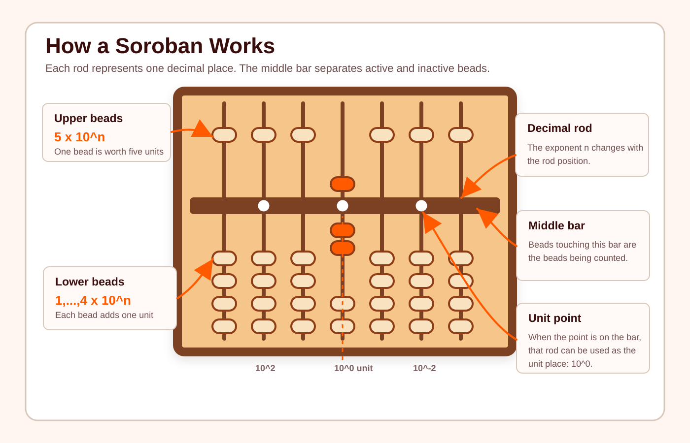

# Soroban Operations Engine

Soroban is the Japanese abacus, a traditional calculating instrument used for centuries in japan to do basic arithmetic operations. 
The Soroban has 3 main parts: 
- The Upper Beads: Equal $ 5 \cdot 10^n$ depending on its place value rods.
- The Lower Beads: Each bead equals $1 \cdot 10^n$ depending on its place value rods.
- The Reckoning Bar: Separates Upper and Lower Beads and also assigns the place value to the beads column. If it has a point in it, it can be used as the units rod. The default is the center one.  

## Objective
This project aims to develop a rule-aware Soorban operation engine capable of generating valid arithmetic sequences depending on the selected learning level; eventually adapting exercise difficulty to individual student performance.  
The algorithm is currently and will still be used as the main engine for Soroban Operation based games in the [Soroban.mx](https://www.soroban.mx) web page (subscription required).

 
## Assumptions
The levels to choose are (The levels are accumulative): 
- Level 1: Only sums that are below 5; i. e. 3 + 1 or 1 + 2
- Level 2: Only subtractions below 5; i. e. 4 - 3 or 2 - 1
- Level 3: Sums up to 9 but without using the 5-complement; i. e. 2 + 7, 6 + 1, but not 3 + 4
- Level 4: Subtractions with 9 as the max value to subtract from, using the 5-complement is not permitted; i. e. 9 - 4, 4 - 3, but no 7 - 4 or 5 -2 
- Level 5: Sums using the 5-complement, but up to 9; i. e. 3 + 4,  4 + 2.
- Level 6: Subtractions using the 5-complment but 9 is the max value to be subtracted from; i. e. 7 - 4, 5 - 3
- Level 7: Sums using the 10-complement, the ten column can't be 4 or 9. The sum cannot require another level to be done; i. e. 3 + 8 and 6 + 9 are permitted, as when summing, in 3 + 8, to carry 8, it requires to subtract 2 and add 10, but 6 + 7 is not permitted as you can't subtract 3 without using level 6. 
- Level 8: Subtractions using the 10-complement, the ten column can't be 5 or 0. The subtraction cannot require another level to be done; i. e. 10 - 4 and 12 - 9 are permitted, as when subtracting, in 10 - 4, to carry 4, it requires to subtract 10 and add 6, but 14 - 7 is not permitted as you can't add 3 without using level 5. 
- Level 9: Combination of Level 7 and Level 6, the tens can't be 4 or 9; i. e. 7 + 6 or 5 + 8 are permitted, but 45 + 7 is not. 
- Level 10: Combination of Level 8 and Level 5, the tens can't be 0 or 5; i. e. 14 - 7 and 32 - 6 are permitted, but 53 - 8 is not
- Level 11.1: Combination of Level 9 and Level 5 or Level 7 and Level 5, tens can't be 9; i. e. 46 + 7 and 48 + 4 are permitted, but 97 + 7 is not
- Level 11.2: Combination of Level 10 and Level 6 or Level 6 and Level 6, tens can't be 0; i. e. 56 - 7 and 54 - 8 are permitted, but 103 - 8 is not. 
- Level 12.1: Combination of Level 0 and Level 7 or Level 7 and Level 7, no restriccions; i. e. 45 + 59, 98 + 12. Getting to ninety something plus something equals one hundred and something is preferred.
- Level 12.2: Combination of Level 10 and Level 8 or Level 8 and Level 8, must have a hundred; i. e. 103 - 5, 101 - 6. Getting to one hundred and something minus something equals ninety something is preferred.

## Next stages
The current version of the engine has already determined which operands are valid for each Soroban level using a rule-based lookup table that maps each level and current value to its set of valid operands. Once the valid candidates are identified, the engine samples from them using manually assigned weights.

These weights were initially introduced to reduce undesirable outcomes, such as repeatedly selecting zero or other low-impact operations. Nevertheless, the current weighting scheme can still produce undesirable repetitive sequences.

The next stage of the project is to improve the sampling strategy. The objective is to generate sequences that remain valid for the selected level while also producing a more balanced and challenging distribution of operations.

The selection probability of each valid operand should take into account factors such as:

How frequently that operand has appeared recently
How many valid alternatives are available from the current state
The level of the operation, prioritizing the highest available level or an operation that can later lead to the highest possible level
The estimated difficulty of the operation

This would allow the engine to dynamically adjust the probability of each candidate instead of relying on fixed, arbitrary weights.

A later stage will introduce a difficulty model that distinguishes between operations belonging to the same level and operations that require a combination of multiple levels.

Finally, anonymized student performance data, such as response time, accuracy, operation level, and recent performance history, can be used to adapt the sampling strategy to each student. The long-term objective is for the engine to dynamically select valid operations that provide an appropriate level of challenge while maintaining sufficient variety across exercises.

## Current Status

- [x] Random operation generator
- [x] Weighted number selection by level
- [x] Rule-based validation engine
- [ ] Constraint-based operation generation
- [ ] Difficulty scoring
- [ ] Student performance data collection
- [ ] Adaptive exercise selection model

